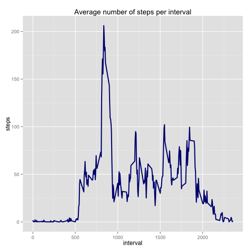

Reproducible Research: Peer Assessment 1
========================================


## Load required packages

```r
library(lubridate)
library(ggplot2)
library(plyr)
```

## Loading and preprocessing the data

Assuming data has already been downloaded from source and unzipped.

```r
activity <- read.csv("activity.csv")
```

## What is mean total number of steps taken per day?

```r
daily.steps <- aggregate(steps ~ date, data = activity, sum, na.rm=TRUE)

ggplot(daily.steps, aes(steps)) + geom_histogram(colour = "navyblue", fill = "white", binwidth = 1000) + 
    ggtitle("Total Steps Taken by Day") 
```

 

```r
mean(daily.steps$steps)
```

```
## [1] 10766.19
```

```r
median(daily.steps$steps)
```

```
## [1] 10765
```

## What is the average daily activity pattern?


```r
daily.average <- aggregate(steps ~ interval, data = activity, mean, na.rm = TRUE)

ggplot(daily.average, aes(interval, steps)) + geom_line(colour = "navyblue", size=1) + 
    ggtitle("Average number of steps per interval")
```

 

```r
daily.average[which.max(daily.average$steps),1]
```

```
## [1] 835
```

## Imputing missing values


```r
sum(is.na(activity$steps))
```

```
## [1] 2304
```

```r
impute.mean <- function(x) replace(x, is.na(x), mean(x, na.rm = TRUE))
act.fixed <- ddply(activity, ~ interval, transform, steps = impute.mean(steps))
fixed.steps <- aggregate(steps ~ date, data = act.fixed, sum, na.rm = TRUE)

ggplot(fixed.steps, aes(steps)) + geom_histogram(colour = "firebrick", fill = "white", binwidth = 1000) +
    ggtitle("Total Steps Taken by Day") 
```

 

```r
mean(fixed.steps$steps)
```

```
## [1] 10766.19
```

```r
median(fixed.steps$steps)
```

```
## [1] 10766.19
```

#### Do these values differ from the estimates from the first part of the assignment? What is the impact of imputing missing data on the estimates of the total daily number of steps?
The mean stays the same, as expected when imputing interval mean values for the 'na' values.
The median differs, adding the values alters the median value very slightly. 

## Are there differences in activity patterns between weekdays and weekends?


```r
act.fixed$weekday <- ifelse(wday(act.fixed$date) >1 & wday(act.fixed$date) <7, "weekday", "weekend")
weekday.average <- aggregate(steps ~ interval + weekday, data=act.fixed, mean)

ggplot(weekday.average, aes(interval, steps)) + geom_line(colour="firebrick", size=1) + facet_grid(weekday~.)
```

 
